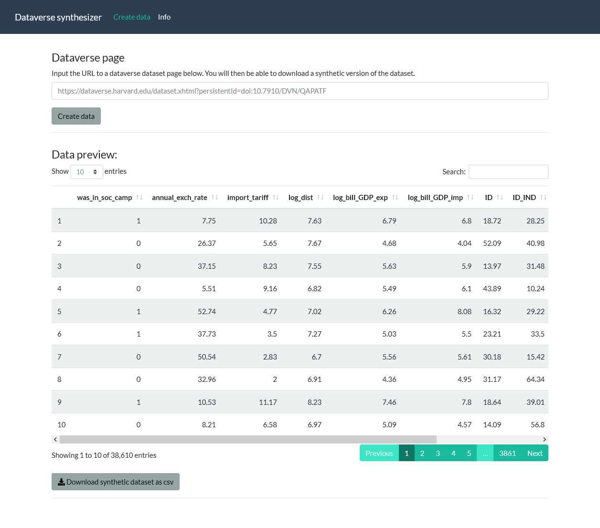

# Dataverse synthesizer

This app lets you __synthesize__, __inspect__, and __download__ data from a [dataverse](https://dataverse.org/) data page (such as [this one](https://dataverse.harvard.edu/dataset.xhtml?persistentId=doi:10.7910/DVN/QAPATF)). You enter the data page URL (e.g., `https://dataverse.harvard.edu/dataset.xhtml?persistentId=doi:10.7910/DVN/QAPATF`) and the app will present you with a fake, randomly generated synthetic dataset which you can save on disk:



## How it works
The app grabs the [DDI](https://ddialliance.org/)-formatted xml metadata of the dataset from the dataverse page, finds the variable-level information and generates columns accordingly. This also means that if your data page does not contain variable-level information, the app will not generate any data.

## How to run locally
This is a small prototype [Shiny](https://shiny.rstudio.com/) app. First, open `R` and make sure the dependencies are installed:
```r
install.packages("tidyverse", "DT", "httr", "xml2", "truncnorm")
```

Then run the app from `R` by entering the following code:

```r
shiny::runGitHub("sodascience/ddi-synth", ref = "main")
```

## Contact
This package is developed by the [ODISSEI Social Data Science (SoDa) team](https://odissei-data.nl/soda).

Do you have questions, suggestions, or remarks? File an issue in the issue tracker or feel free to contact Erik-Jan van Kesteren [@ejvankesteren](https://twitter.com/ejvankesteren).

